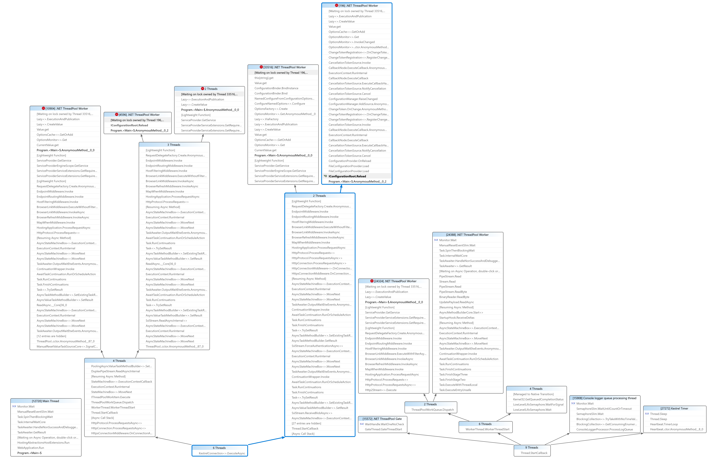

# ConfigurationManager Deadlock Repro

Repro for https://github.com/dotnet/runtime/issues/61747

## Steps to reproduce

First, run the application.

```powershell
dotnet run --configuration Release
```

Then in one terminal, run the following command:

```powershell
while ($true) { iwr http://localhost:5000/value | Out-Null }
```

Then in another terminal, run the following command:

```powershell
while ($true) { iwr http://localhost:5000/reload -Method POST | Out-Null }
```

Now continue to add additional terminals/threads running the `GET /value` request until the application deadlocks.

The application will eventually deadlock similar to the manner shown in the below _Parallel Stacks_ screenshot.


